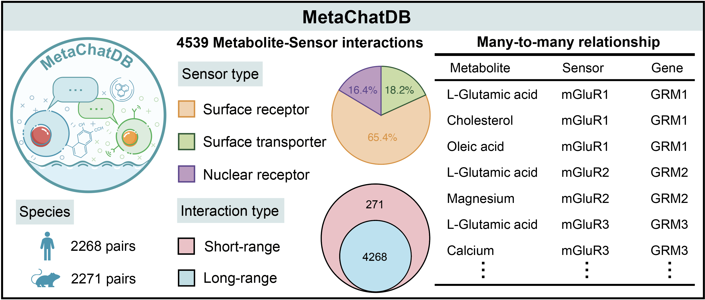

.. MetaChat documentation master file, created by
   sphinx-quickstart on Mon Jun 24 03:12:12 2024.
   You can adapt this file completely to your liking, but it should at least
   contain the root `toctree` directive.

Welcome to MetaChat's documentation!
====================================

MetaChat: Spatial metabolic communication flow of single cells
==============================================================

**MetaChat** is a Python package to screen metabolic cell communication (MCC) from spatial 
multi-omics data of transcriptomics and metabolomics. It contains many intuitive visualization 
and downstream analysis tools, provides a great practical toolbox for biomedical researchers.

Metabolic cell communication
============================

Metabolic cell-cell communication (MCC) occurs when sensor proteins in the receiver cells detect 
metabolites in their environment, activating intracellular signaling events. There are three major 
potential sensors of metabolites: surface receptors, nuclear receptors, and transporters. Metabolites 
secreted from cells are either transported over short-range distances (a few cells) via diffusion 
through extracellular space, or over long-range distances via the bloodstream and the cerebrospinal fluid (CSF).

.. image:: image/metabolic_cell_communication.png
   :alt: Metabolic cell communication

MetaChatDB
==========

MetaChatDB is a literature-supported database for metabolite-sensor interactions for both human and mouse. All 
the metabolite-sensor interactions are reported based on peer-reviewed publications. Specifically, we manually 
build MetaChatDB by integrating three high-quality databases (PDB, HMDB, UniProt) that are being continually updated.

New
===

- Jun 26, 2024: We released MetaChat version 0.0.2. This version standardizes function names and fixes some bugs.

MetaChat's features
===================

- MetaChat uses a Flow Optimal Transport algorithm, which frames MCC inference as an optimal transport problem from 
  metabolite distributions to sensor distributions that are constrained by metabolite transport flow conditions. This 
  algorithm simultaneously considers short- range and long-range transport of metabolites, as well as species competition 
  between metabolites and sensors.

- MetaChat has multiple visualization and downstream analysis tools to dissect MCC flow directions, multiple levels of MCC 
  aggregation, pairwise MCC pathway patterns between cell groups, and MCC remodelling in receiver cells.

- The method can flexibly be applied to either spatial multi-omics measurements on either the same or multiple tissue slices, 
  or, in combination with flux analysis, spatial transcriptomics alone of varying spatial resolution (single-cell or spot-level), 
  meaning that vast amounts of existing data can be analyzed immediately for MCC.

.. toctree::
   :maxdepth: 2
   :caption: Contents:

   installation
   tutorials
   api/index

Indices and tables
==================

* :ref:`genindex`
* :ref:`modindex`
* :ref:`search`